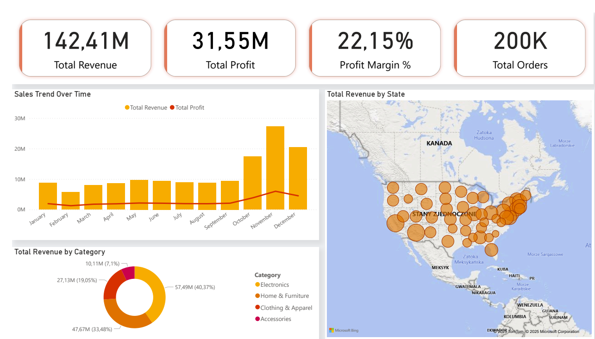
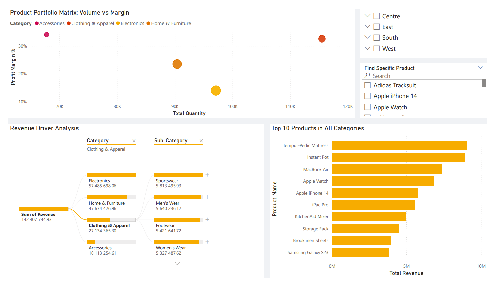

<div align="center">

# Sales Performance & Profitability Dashboard
### End-to-End Analytics: From Python ETL to Power BI Storytelling


<br />

**[ Explore the Notebook ](product_sales_analysis.ipynb) • [ View SQL Queries ](product_sales_queries.sql) • [ Report Bug ](issues)**

</div>

---

## Project Overview
**Sales Performance & Profitability Dashboard** is an end-to-end data analytics project designed to identify key revenue drivers, optimize product portfolios, and segment customers effectively.

The goal was to transform raw transaction data into actionable business insights using a full-stack approach. By processing over **200,000 sales records**, this project moves beyond simple reporting to uncover high-margin opportunities and regional trends.

## Repository Contents
* **`product_sales_analysis.ipynb`**: The Python ETL pipeline (cleaning, feature engineering).
* **`product_sales_queries.sql`**: A collection of 20+ advanced SQL queries answering specific business questions.
* **`data/`**: Folder containing the `product_sales_dataset_final.csv`.
* **`screenshots/`**: Dashboard images for documentation.

## The Data Story
The value of this project lies in connecting raw metrics to business strategy. Through analysis, we uncovered three critical insights:

* **Profitability vs. Volume:** While *Electronics* generate the highest revenue, *Accessories* provide a better profit margin (15%+), suggesting a pivot in marketing strategy.
* **The Pareto Principle:** The top 20% of customers contribute to nearly 60% of total revenue.
* **Regional Seasonality:** The *South Region* underperforms in Q3, a trend identified via Decomposition Tree analysis.

## Visual Insights
*We believe in interactive storytelling.* The Power BI dashboard is designed for drill-down analysis.

> 
>
> *Figure 1: Executive Overview showing Revenue, Profit, and YoY Growth.*

> 
>
> *Figure 2: Product Performance using AI-based Decomposition Trees.*

## Tech Stack & Methods

| Component | Technology | Description |
| :--- | :--- | :--- |
| **ETL Pipeline** | Python (Pandas) | Data cleaning, type standardization, feature engineering (`Margin`, `Year`). |
| **Data Warehousing** | PostgreSQL | SQL Schema design and data loading via `SQLAlchemy`. |
| **Analysis** | Advanced SQL | Window Functions (`NTILE`, `RANK`), CTEs, and complex aggregations. |
| **Visualization** | Power BI | DAX measures, Decomposition Trees, and dynamic UX/UI. |

## How to Run
To replicate this analysis on your local machine:

1.  **Clone the repository:**
    ```bash
    git clone [https://github.com/marta23-10/sales-analytics-portfolio.git](https://github.com/marta23-10/sales-analytics-portfolio.git)
    cd sales-analytics-portfolio
    ```
2.  **Install dependencies:**
    ```bash
    pip install pandas sqlalchemy psycopg2
    ```
3.  **Run the ETL script:**
    Update your database credentials in the script and run:
    ```bash
    python product_sales_analysis.ipynb
    ```
4.  **Explore SQL:**
    Open `product_sales_queries.sql` in pgAdmin or DBeaver.

## Project Roadmap
This project follows a standard industry data pipeline:

- [x] **Phase 1: Data Engineering (Python)**
    - Ingesting raw CSV data.
    - Validating data integrity (`Revenue = Quantity * Unit Price`).
- [x] **Phase 2: Warehousing (PostgreSQL)**
    - Establishing database connection.
    - Loading cleaned data into structured SQL tables.
- [x] **Phase 3: Deep Dive Analysis**
    - Executing SQL queries for customer segmentation.
    - Identifying top-performing regions.
- [x] **Phase 4: Visualization (Power BI)**
    - Modeling data with DAX.
    - Designing the interactive dashboard.

## Contributing
Contributions are welcome! If you have ideas for optimizing the SQL queries or new DAX measures:
1.  Fork the repo.
2.  Create your feature branch.
3.  Submit a Pull Request.

---
<div align="center">
    <p><i>Created with Python, PostgreSQL & Power BI</i></p>
</div>
